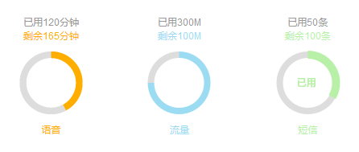

##PercCircle


PercCircle is a javascript plugin to create a circle showing percentage of data.

##Usage
html:
```html
<div id="chart"></div>
```
javascript:
```html
<script src="PercCircle.js"></script>
<script>
    var percentCircle = new PercCircle('#chart', {
		data: [{
			name: 'Used',
			value: 30,
			color: '#ccc'
		}, {
			name: 'Rest',
			value: 70,
			color: '#f00'
		}]
    });
    percentCircle.init();
</script>
```

##Params
```html
PercCircle( el, opts )
```
1. `el` the element you want to put the percent-circle chart in.

	there are two forms you can use ('string' or 'object'):
```html
// form 1
var percentCircle = new PercCircle('#chart', options);

// form 2
var chart = document.getElementById('chart');
var percentCircle = new PercCircle(chart, options);
```
2. `opts` options to costomize the plugin and the percent circle.

##Options
| Option        | Value         | Desciption  |
| :------------- |:-------------| :-----|
| circleScale | Interger | Size of circle to the canvas. `default: 0.7` |
| lineWidth | Interger (px) | Line width of circle. `default: 14` |
| hoverEffect | Boolean | Effects when cursor pass the circle part. `default: true` |
| hoverLineWidth | Interger (px) | Line width when cursor pass the circle part. (need 'hoverEffect' to be true) `default: lineWidth + 4` |
| pointer | Boolean | Turn to pointer cursor when it pass the circle part. (need 'hoverEffect' to be true) `default: true` |
| showName | Boolean | Show data name when cursor pass the circle part. (need 'hoverEffect' to be true) `default: true` |
| showValue | Boolean | Show data value when cursor pass the circle part. (need 'hoverEffect' to be true) `default: false` |
| showPercent | Boolean | Show data percentage when cursor pass the circle part. (need 'hoverEffect' to be true) `default: true` |
| fontFamily | String | Font family of data name, value and percentage. (need 'hoverEffect' and at least one of 'showName', 'showValue', 'showPercent' to be true) `default: 'Microsoft Yahei'` |
| fontSize | Interger (px) | Font size of data name, value and percentage. (need 'hoverEffect' and at least one of 'showName', 'showValue', 'showPercent' to be true) `default: 14` |
| bold | Boolean | Whether font weight need to be bold. (need 'hoverEffect' and at least one of 'showName', 'showValue', 'showPercent' to be true) `default: true` |
| animate | Boolean | Animation when initializing the plugin. `default: true` |
| animateTime | Interger (ms) | Lasting time of animation. (need 'animate' to be true) `default: 500` |
| data | Array | Data on which percent circle is based. If there is no data input, it will throw 'No data...' error. `default: []` |

##Public Methods
1. `init` initialize the plugin.

##License
This plugin is licensed under [MIT](LICENSE).